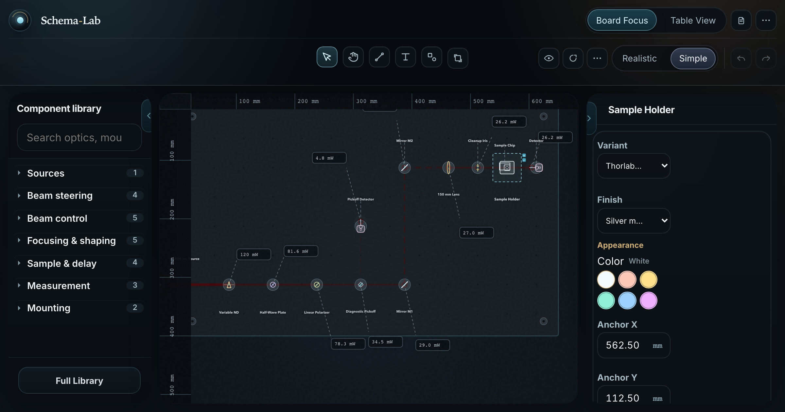

# Schema-Lab

Schema-Lab is a browser-based optics workspace for laying out, tracing,
reviewing, and exporting ultrafast optics setups such as FROG, Z-scan,
delay-line, OPA, and related lab schematics.

[Use Schema Lab](https://schemalaboratorio.netlify.app) · Current version: `v2.7` ·
Status: early public release



## Platform Note

Schema-Lab is designed for desktop and laptop workflows with a wide canvas,
keyboard, and pointer. Mobile browsers are not a primary target because
practical optical-layout work needs enough screen space to inspect boards,
panels, beam paths, and export controls at once.

## What It Does

- millimeter-first geometry for breadboards, optical tables, component
  footprints, anchors, and ports
- multi-surface placement with breadboards hosted on an optical table
- deterministic beam tracing, beam inspection, and warning generation
- optional Gaussian-beam analysis, overlays, and warning support
- interpreted SVG import with reliable-path mapping and ambiguity review
- scoped SVG, DXF, PNG, PDF, and PPTX exports, with top-down and angled
  presentation views for realistic optical-table scenes
- refined realistic artwork for mirrors, lenses, beamsplitters, BBO crystals,
  laser sources, and detectors
- onboarding, example setup, help, and browser-smoke coverage for critical UI
  flows

## Why It Exists

Small optics and ultrafast labs often need reproducible layout diagrams, beam
paths, and exportable documentation without turning every experiment into a
full CAD project. Schema-Lab focuses on practical optical-table planning:
physical millimeters, readable components, traceable paths, and import/export
workflows that fit research documentation.

## Current Limits

- Desktop-first interface; mobile browsers are not a practical target.
- Early public release; APIs and scene details may still change.
- Stage 1 layout rules use quarter-turn component rotations.
- Import review is designed for useful lab drawings, not arbitrary SVG/CAD
  compatibility.
- It is a planning and documentation tool, not a replacement for optical safety
  review or full physical simulation.

## Roadmap

- Broader component catalog coverage for common optics hardware.
- More regression fixtures for SVG/raster import and export edge cases.
- Stronger release notes and example-scene documentation.
- Additional warning coverage around beam paths, ports, and imported layouts.
- Continued accessibility and desktop workflow polish.

## Stack

- React
- TypeScript
- Vite
- Konva / react-konva
- Zustand
- Vitest

## Local Setup

```bash
npm install
npm run dev
```

## Verification

```bash
npm run lint
npm run test
npm run build
npm run bundle:size
```

For browser smoke coverage, start a local preview server first:

```bash
npm run preview -- --host 127.0.0.1 --port 4173
npm run smoke:ci
```

Useful browser smokes also live under `scripts/playwright-smoke/`, including
optical-table, projected-table, touch, SVG import, and broader UX checks.

## Structure

- `src/domain`: millimeter-space scene model, workspace geometry, tracing,
  Gaussian analysis, import/export, warnings
- `src/state`: Zustand editor state and actions
- `src/canvas`: Konva rendering and interaction logic
- `src/ui`: toolbar, library, inspector, onboarding, warnings, import/export,
  and modal workflows
- `src/test`: unit coverage for geometry, tracing, Gaussian analysis,
  import/export, and serialization
- `.agents/skills`: repo-local skills that capture current project contracts for
  coding agents

Durable project conventions live in [`AGENTS.md`](AGENTS.md).

## Contributing and Security

Schema-Lab is MIT licensed. See [`CONTRIBUTING.md`](CONTRIBUTING.md) for local
workflow guidance and [`SECURITY.md`](SECURITY.md) for vulnerability reporting.
